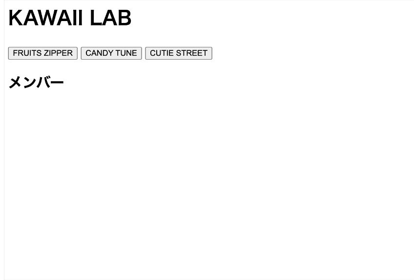

# jsQuiz-neo-03

「配列を使った表示の切り替え」の振り返りです。

## 課題内容

3つのボタンを押したとき、それぞれのグループ（FRUITS ZIPPER / CANDY TUNE / CUTIE STREET）のメンバーを `<ul class="members">` の中に `<li>` で表示する JavaScript を書いてください。



### HTML の構造（ひな形）

- `#fruits_zipper` / `#candy_tune` / `#cutie_street` の3つのボタン
- `<ul class="members">`（初期状態は空）
- データ配列 `fruitsZipper` / `candyTune` / `cutieStreet` は最初から `<script>` に書かれています

### 作る関数

```js
changeMember(team)
```

- 引数: `team`（メンバー名の配列）
- やること:
  1. `<ul class="members">` の中身を一度**空にする**
  2. `team` の各メンバーを `<li>名前</li>` として追加する（`forEach` が便利）

### ボタンクリック時の動き

| ボタン | 表示するメンバー |
|---|---|
| `#fruits_zipper` | `fruitsZipper` 配列のメンバー |
| `#candy_tune`    | `candyTune` 配列のメンバー |
| `#cutie_street`  | `cutieStreet` 配列のメンバー |

**ボタンを切り替えたとき、前のグループのメンバーは残らないこと（総入れ替え）**。

---

## 制作手順（ヒント）

1. `changeMember(team)` を定義
   - `document.querySelector('.members')` で対象を取得
   - `innerHTML = ''` で中身を空に
   - `team.forEach(member => { ... })` で `<li>` を追加
2. 各ボタンに `addEventListener('click', ...)` を設定し、それぞれ対応する配列を渡して `changeMember` を呼ぶ

---

## 提出方法

### ① Fork
このリポジトリを自分のアカウントに Fork してください。

### ② clone
自分の Fork を GitHub Desktop で clone します。

### ③ branch を作る
ブランチ名に「quiz3/自分の名前」を記入する（例：quiz3/kawaguchi）

### ④ コードを書く
`students/{自分の番号}/index.html` を編集して課題を完成させます。
（例：出席番号が 7 番なら `students/7/index.html`）

ルートの `index.html` を `students/{自分の番号}/index.html` にコピーしてから編集するのが簡単です。

### ⑤ commit / push
変更を commit して push してください。
- title：出席番号_名前（例：28_河口）
- message：提出します。

### ⑥ Pull Request を作成
元のリポジトリに向けて Pull Request を作成してください。

## 判定について

- Pull Request を出すと自動判定が実行されます
- 成功 → ✅ **合格！** のコメントが付きます
- 失敗 → ❌ **不合格** のコメントと確認ポイントが付きます

結果は PR のコメント欄と「Checks」タブで確認してください。

## ディレクトリ構成

```
jsQuiz-neo-03/
├── index.html              # 問題ファイル（参照・複製元）
├── students/               # 解答フォルダ ★ここに作業する
│   └── {自分の番号}/
│       └── index.html      # index.html を複製して解答を記述
├── .github/                # 自動判定の設定（触らない）
├── tests/                  # 自動判定の設定（触らない）
├── playwright.config.js    # 自動判定の設定（触らない）
└── README.md
```

## 注意

- `students/{自分の番号}/index.html` の末尾 `<script>` 内だけ編集してください
- HTML構造（`#fruits_zipper` / `#candy_tune` / `#cutie_street` / `.members`）は変えないでください
- データ配列（`fruitsZipper` / `candyTune` / `cutieStreet`）は変更しないでください
- `students/` 以外のファイルは変更しないでください
- エラーが出たら修正して再度 push してください

---

## 模範解答

授業資料の[JSQuiz_neo模範解答](https://2026doc.hideok.org/first-term/javascript/post-quizanswer)